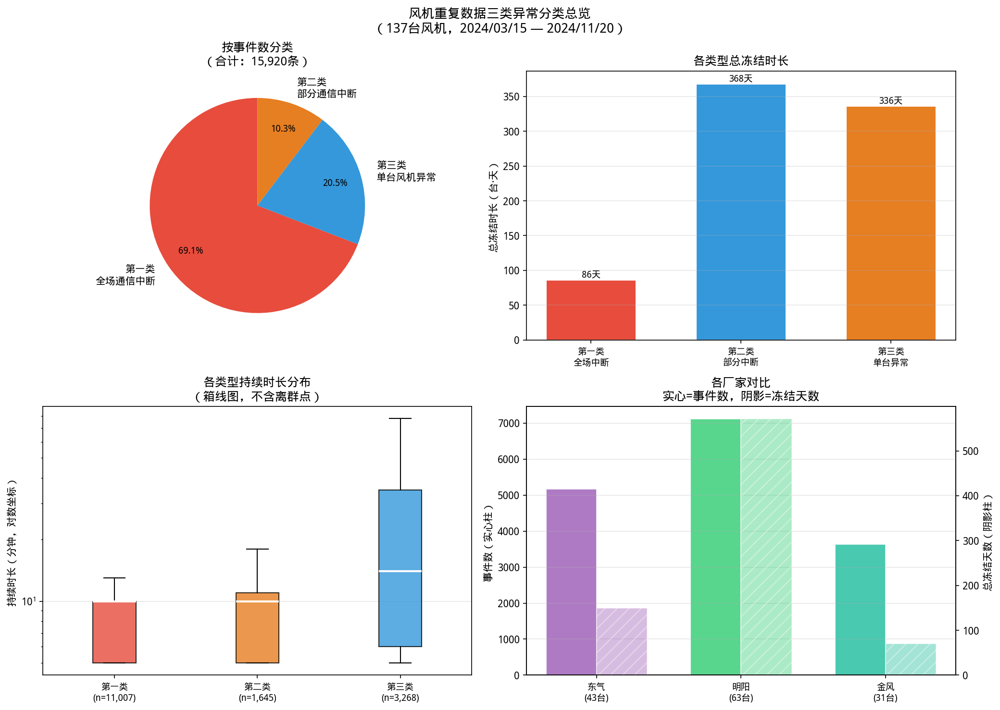
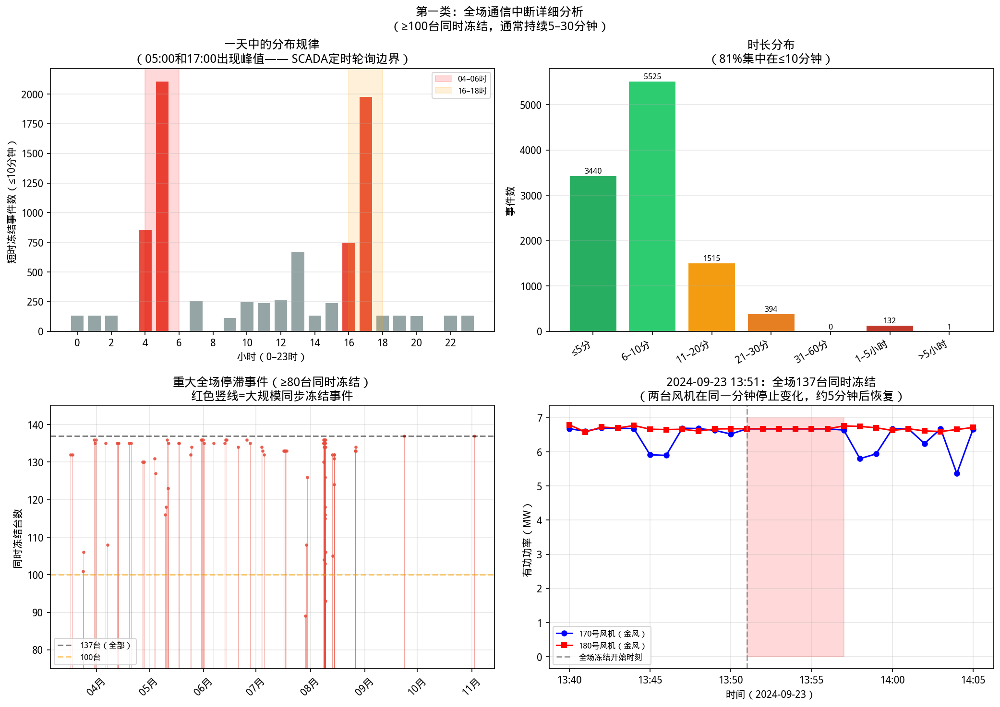
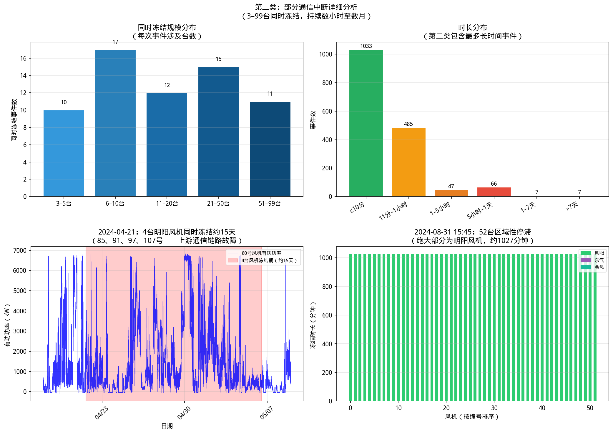
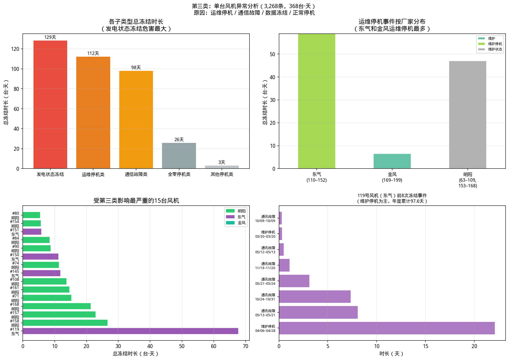
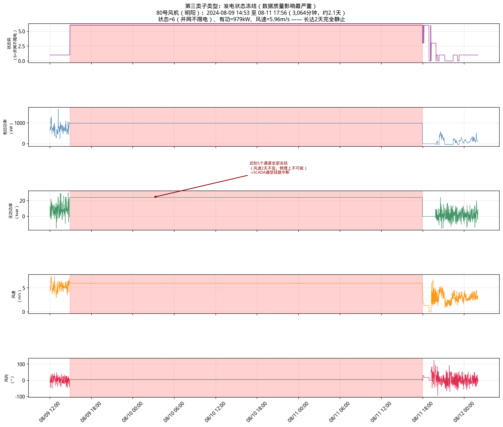
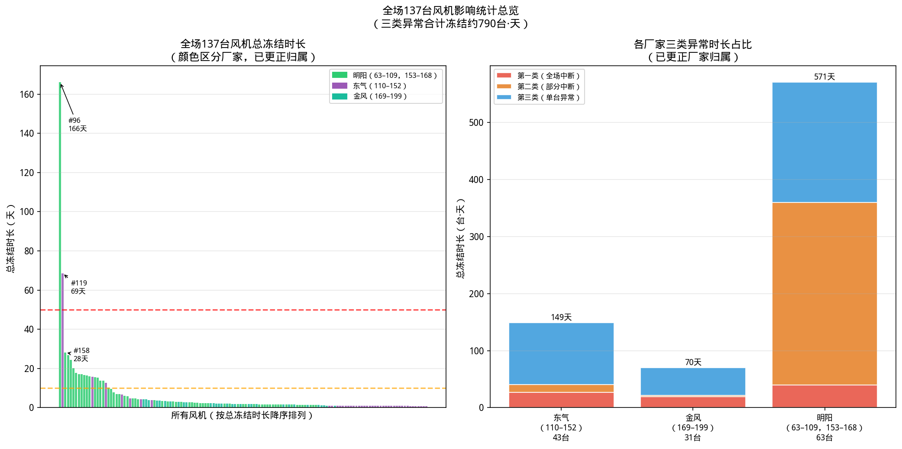

# 风机重复数据原因分析报告（更新版）

## 一、基本情况概述

**分析数据范围：** 2024年3月15日 — 2024年11月20日，共137台风机（编号63–199）

**风机厂家归属（依据更新后的风机状态码说明）：**

| 厂家 | 编号范围 | 台数 | 状态码体系 |
|------|---------|------|----------|
| 明阳 | 63–109、153–168 | 63台 | 0–24 |
| 东气 | 110–152 | 43台 | 实测使用101–113体系 |
| 金风 | 169–199 | 31台 | 实测使用0–6体系 |

> **注：** 实测时序数据显示，东气风机（110–152）实际使用101–113状态码（如101=正常发电、110=维护停机、113=通讯故障），金风风机（169–199）实际使用0–6状态码（如5=发电状态、6=维护状态）。分析中以实测数据为准进行状态码解译。

**重复值检测结果：** 共检测到 **15,920** 个连续重复数据段，总计冻结时长约 **790 台·天**

---

## 二、核心结论

你提出的三类异常分类框架经数据验证，基本准确。以下是验证结果与进一步细化：

| 类型 | 你的描述 | 验证结论 | 根本原因 |
|------|---------|---------|---------|
| **第一类** | 所有风机同时，持续时长较短 | ✅ 准确 | SCADA系统整体通信/轮询中断 |
| **第二类** | 部分风机同时，持续时长较长 | ✅ 准确 | 区域通信链路或集中器故障 |
| **第三类** | 单台风机，状态多样，持续最长 | ✅ 准确，需细分 | 运维停机 + 设备通信掉线 + 数据冻结 |

**关于运维停机的猜测：完全正确。** 单台风机异常中，运维停机（维护停机/维护状态/维护）是最大的一类原因，占第三类总冻结时长的 **31%**。

---

## 三、三类异常统计汇总

| 异常类型 | 事件数 | 平均时长 | 最大时长 | 总冻结时长 |
|---------|-------|---------|---------|---------|
| 第一类：全场通信中断（≥100台同时） | 11,007 | 11.3分 | 1,440分 | 86天 |
| 第二类：部分通信中断（3–99台同时） | 1,645 | 294.3分 | 236,874分 | 336天 |
| 第三类：单台风机异常（1–2台） | 3,268 | 162.2分 | 31,799分 | 368天 |

---

## 四、第一类：全场通信中断

### 4.1 典型特征

- **规模**：100–137台风机在同一时刻同时出现数据冻结
- **时长**：绝大多数（81%）持续 5–10 分钟，少数延续至 1–2 小时
- **规律性**：约 65% 的短时（≤10分钟）事件集中在每天 **04:00–06:00** 和 **16:00–18:00** 两个时段

### 4.2 最强证据：全场137台同步冻结

| 时间点 | 同时冻结台数 | 中位时长 |
|--------|-----------|---------|
| 2024-09-23 13:51 | **137台（100%）** | 6分钟 |
| 2024-11-02 10:38 | **137台（100%）** | 22分钟 |
| 2024-05-11 04:59 | 136台 | 10分钟 |
| 2024-08-08—09（多次） | 130–136台 | 5分钟 |

**137台不同厂家的风机在同一时刻同时冻结，绝对不可能是各台风机自身通信同时中断的巧合。只能是 SCADA/数据历史库上层系统出现了整体性故障或定时任务。**

### 4.3 05:00/17:00 周期性冻结：SCADA 定时轮询的副作用

每天两次，几乎全场风机在 05:00 和 17:00 前后同步出现 5–10 分钟冻结，这是 SCADA 系统定时任务（如数据批量上送、轮询边界切换、日报表生成）期间暂停实时采集所致。历史库在此期间持续写入上一时刻的值。

以80号风机 2024-03-17 05:00 为例（图2中可见）：
- 04:59：有功功率 1,695 kW，正常波动
- **05:00–05:09**：5个字段完全锁定，一分钟内毫无变化
- 05:10：恢复为 2,154 kW，继续正常波动

这是 SCADA "数据采集暂停 + 历史值保持" 的典型表现，属于系统设计层面的周期性现象，**不代表风机本身有问题**。

---

## 五、第二类：部分通信中断

### 5.1 典型特征

- **规模**：3–99台风机在同一时刻开始冻结（通常属于同一区域或网段）
- **时长**：差异大，从数分钟到数月不等
- **原因**：区域通信链路上的某个节点（集中器、工业交换机、子网 SCADA 进程）发生故障

### 5.2 重大事件案例

**案例一：2024-04-21 14:56，85、91、97、107号（明阳）同时冻结约15天**

这4台明阳风机同时于 2024-04-21 14:56 开始冻结，持续约 21,468–21,469 分钟（约 14.9 天），直至 2024-05-06 才恢复。

| 风机 | 冻结值（状态/有功/无功/风速/风向） | 分析 |
|------|--------------------------------|------|
| \#85 | 并网不限电, 0kW, 0, 9.73m/s, -50.7° | 功率为零但风速非零，异常冻结 |
| \#91 | 并网不限电, 2644kW, 41, 7.43m/s, 4.7° | 正常发电时的数据被冻结 |
| \#97 | 并网不限电, 3560kW, 40, 9.02m/s, 8.5° | 正常发电时的数据被冻结 |
| \#107 | 并网不限电, 2098kW, 27, 7.94m/s, 19.7° | 正常发电时的数据被冻结 |

4台风机同时冻结、同时恢复，明确指向它们共用的某个上游通信节点发生了长达 15 天的故障。

**案例二：2024-08-31 15:45，52台明阳风机同时冻结约17小时**

**案例三：2024-03-15（数据起始），96号风机冻结165天（同时伴随少数其他风机）**

### 5.3 第二类与第一类的区分

第二类与第一类的本质区别是**受影响范围**：第一类影响全场所有厂家，说明故障在最顶层（全场 SCADA 或数据历史库服务器）；第二类仅影响特定子集，说明故障在中间层（区域集中器或子网）。

---

## 六、第三类：单台风机异常

### 6.1 细分结果

第三类共 3,268 条事件，进一步按状态码细分：

| 子类型 | 事件数 | 总冻结时长 | 说明 |
|-------|-------|---------|------|
| **运维停机类** | 1,688 | **112.4天** | 维护停机/维护状态/维护/检修 |
| **发电状态冻结** | 258 | **128.6天** | 并网发电状态下数据被冻结（数据质量最严重） |
| **通信故障类** | 555 | 98.1天 | 无通讯/通讯故障（风机控制器感知到断链） |
| **全零停机类** | 586 | 25.9天 | 功率和风速均为零（正常停机状态） |
| 其他停机类 | 181 | 3.2天 | 偏航解缆等非发电状态 |

### 6.2 运维停机：确认为重要原因

**你的猜测是正确的**。运维停机是第三类中事件数最多的子类型（1,688条），在三个厂家中均有体现：

| 厂家 | 状态码含义 | 事件数 | 总冻结时长 | 最长单次 |
|------|----------|-------|---------|--------|
| 东气（110–152） | 维护停机（状态码110） | 849 | 58.9天 | **22.1天**（119号，2024/4/6–4/28） |
| 金风（169–199） | 维护状态（状态码6） | 759 | 47.0天 | 21.9小时（175号） |
| 明阳（63–109,153–168） | 维护（状态码13） | 80 | 6.5天 | 3.9天（64号） |

**119号风机**（东气）的最长运维停机事件持续 31,799 分钟（22.1天），从 2024-04-06 10:04 至 2024-04-28 12:02，状态码全程保持为 110（维护停机）。这是一次正常的长期运维作业，数据保持不变是因为风机停机后所有传感器读数恒定。

### 6.3 发电状态冻结：数据质量最大风险

发电状态冻结指风机**正在正常并网发电时**，5个数据字段被完全冻结（功率、风速均非零且保持不变），共持续 128.6 台·天，是数据质量影响最严重的类型。

以80号风机 2024-08-09 14:53 至 08-11 17:56（3,064分钟，约2.1天）为例（图5）：

- 冻结值：状态=6（并网不限电）、有功=979kW、无功=24kvar、风速=5.9603m/s、风向=5.1823°
- 5个字段在 3,064 分钟内完全一致，标准差为零（1.78×10⁻¹⁵）
- **2.1天内风速毫无变化，物理上不可能**，确认为通信链路冻结

如果将这段数据作为有效发电数据使用，会产生严重的统计偏差。

### 6.4 通信故障类（明阳无通讯状态）

明阳风机在通信中断时，控制器会将状态码切换为 **1（无通讯）**，但 SCADA 历史库仍继续写入中断前最后一次接收的所有测量值。

这类情况中，**状态码（1=无通讯）是真实的**（控制器主动上报），但**有功功率、风速等测量值是冻结的假值**（最后一次通信前的真实值）。

典型案例：71号风机 2024-11-06 至 11-20（21,351分钟，约14.8天），状态=1（无通讯）、有功=2632kW——说明风机在通信中断时正在发电，此后两周数据均为假值。

---

## 七、各厂家总体对比

| 厂家 | 台数 | 总事件数 | 总冻结时长 | 最长单台冻结 | 主要原因 |
|------|------|---------|---------|-----------|--------|
| 明阳（63–109,153–168） | 63台 | 7,113 | 570.8天 | 166.2天（\#96） | 通信故障+发电状态冻结+停机 |
| 东气（110–152） | 43台 | 5,170 | 149.2天 | 68.6天（\#119） | 运维停机+通讯故障 |
| 金风（169–199） | 31台 | 3,637 | 70.4天 | <2天 | 运维停机+停机状态 |

**注：** 明阳冻结时长最多，一方面因为台数最多（63台），另一方面也有个别极端案例（96号风机165天）拉高总量。金风单机最长冻结时间明显短于其他两家（<2天），可能与通信架构或设备性能差异有关。

---

## 八、重点关注风机

### 8.1 96号风机（明阳）：极端案例，建议立即排查

从数据起始日（2024-03-15 00:00）至 2024-08-27 11:53，持续 **165天** 完全冻结在 `(状态=6, 功率=0, 风速=0, 风向=0)`。165天内数据全部无效，整个春夏季的发电数据均不可用。

这属于彻底的通信链路断开或数据接入设备（如工业网关、数据集中器）长期故障，与第二类事件共同发生（该时段同一时刻还有少数其他风机也冻结）。

### 8.2 119号风机（东气）：运维+通讯双重叠加

总冻结时长 68.6 天，由两大事件构成：
- 2024-04-06 至 04-28：22.1天，状态=110（**维护停机**）
- 2024-05-13 至 05-21：8.1天，状态=113（**通讯故障**）
- 2024-10-24 至 10-31：7.3天，状态=113（**通讯故障**）

运维后发生多次通讯故障，建议核查该风机通信设备是否在运维期间受损。

### 8.3 2024-04-21：大规模区域通信故障

85、91、97、107号（明阳）四台风机同时冻结 14.9 天，说明服务该区域的通信设备（集中器/交换机）发生了长达 15 天的故障，同期可能有其他风机也受影响但时间略有不同。

---

## 九、结论与数据处理建议

### 9.1 综合结论

1. **第一类（全场，11,007条）**：SCADA 系统整体定时轮询中断，每天05:00/17:00各一次，每次5–10分钟，属于系统级规律性现象，不反映风机状态问题。

2. **第二类（部分，1,645条）**：区域通信链路或集中器故障，涉及同一子网的多台风机，持续时间从几分钟到165天不等，数据均为无效冻结值。

3. **第三类（单台，3,268条）**：细分为四个子类：
   - **运维停机**（112天）：风机主动停机维护，数据冻结反映真实停机状态，**数据质量无问题**（可标记为停机）
   - **发电状态冻结**（129天）：风机正在运行时通信中断，功率/风速被冻结，**数据完全不可用**
   - **通信故障**（98天）：风机报"无通讯/通讯故障"，测量值为中断前的最后值，**数据不可用**
   - **停机全零**（26天）：风机停机时传感器全零，属**正常物理现象**，可保留

### 9.2 数据清洗建议

| 分析场景 | 建议处理方式 |
|---------|-----------|
| 发电量统计 | 剔除所有持续 >5 分钟且状态码为发电类（明阳6、东气101/106、金风5）的重复段 |
| 功率曲线拟合 | 剔除所有持续 >5 分钟的重复段（包含周期性轮询中断） |
| 停机分析 | 保留状态码为运维类的重复段（明阳13、东气110、金风6），但需标注为运维停机 |
| 通信质量评估 | 统计明阳状态=1、东气状态=113的重复段总时长 |
| 发电数据完整性 | 重点关注96号（166天）、119号（68.6天）、158号（28天）风机，数据有效率极低 |

---

## 十、附图

### 图1：三类异常分类总览

*左上：按事件数分，第一类占比最大（69%）；左侧：按总冻结时长分，第三类影响最深（368天）*  
*右上：三类事件时长分布差异悬殊（第一类集中在5–30分钟，第二类和第三类跨度达数月）*  
*右下：按厂家（已更正归属）统计事件数与冻结天数*

---

### 图2：第一类——全场通信中断详细分析

*左上：短时冻结（≤10分钟）的小时分布，04–06时和16–18时两个峰值（SCADA定时任务边界）*  
*右上：第一类事件时长分布，81%集中在5–10分钟*  
*左下：全年重大全场冻结事件（≥80台同时），全场事件在各月均有发生*  
*右下：2024-09-23 13:51，170号和180号风机同步冻结的微观细节（同时停止变化，5分钟后恢复）*

---

### 图3：第二类——部分通信中断详细分析

*左上：第二类事件的集群规模分布（3–99台）；右上：时长分布（部分事件持续数月）*  
*左下：85/91/97/107号明阳风机2024-04-21同时冻结14.9天的时序图*  
*右下：2024-08-31 52台明阳风机的区域性冻结事件*

---

### 图4：第三类——单台风机异常详细分析

*左上：第三类四个子类型的总冻结时长对比（发电状态冻结影响最大，运维停机最多发）*  
*右上：运维停机事件按厂家分类（东气维护停机占主导）*  
*左下：受第三类影响最严重的15台风机*  
*右下：119号（东气）的典型运维停机时间分布*

---

### 图5：第三类子类型——发电状态冻结（80号风机，2024-08-09 至 08-11）

*红色阴影区=冻结期（3,064分钟，2.1天）：风速、功率等5个字段完全静止不变，物理上不可能，为SCADA通信链路中断后的历史库重复写入*

---

### 图6：全场137台风机总影响统计

*左：所有风机总冻结时长降序排列（绿=明阳，紫=东气，青=金风），96号风机遥遥领先*  
*右：三类异常在各厂家中的时间分布（明阳绝对值最大，东气每台平均影响最深）*
