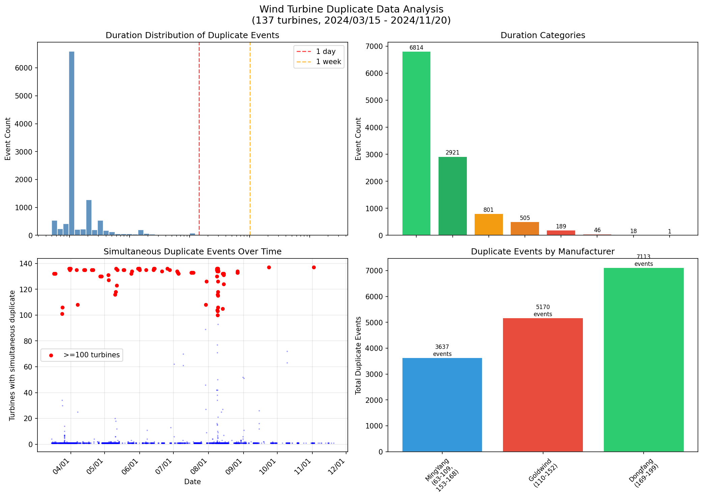
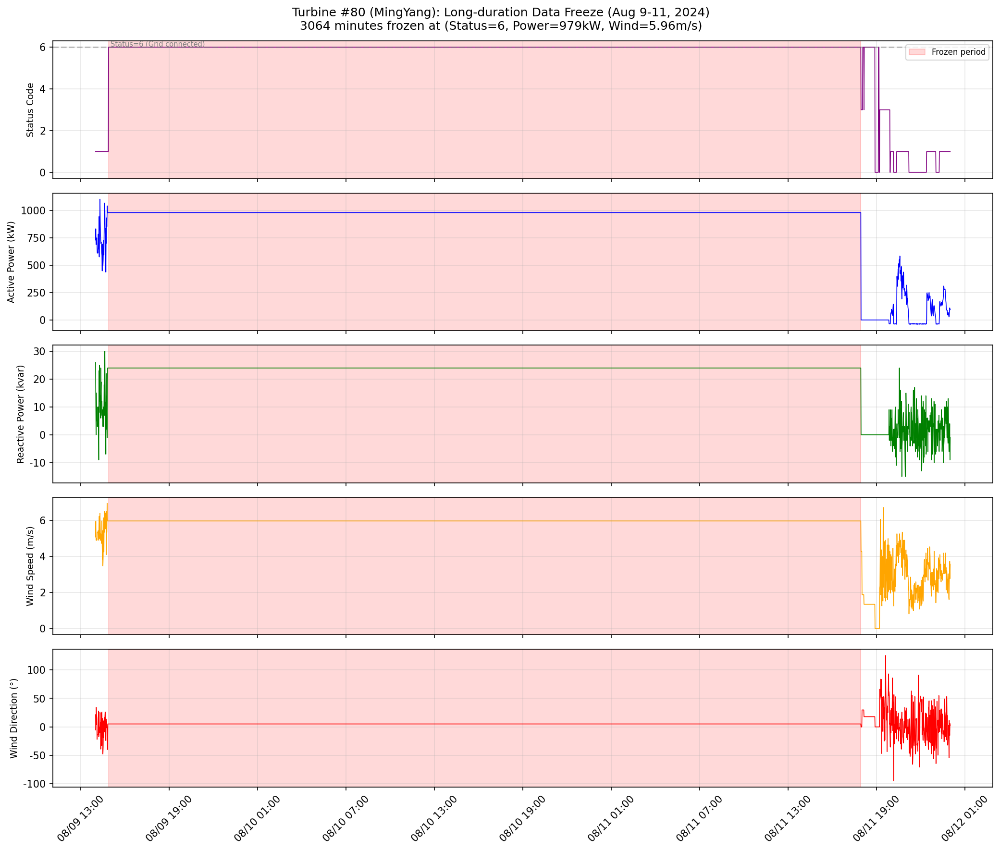
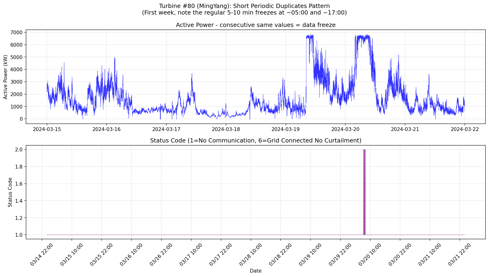
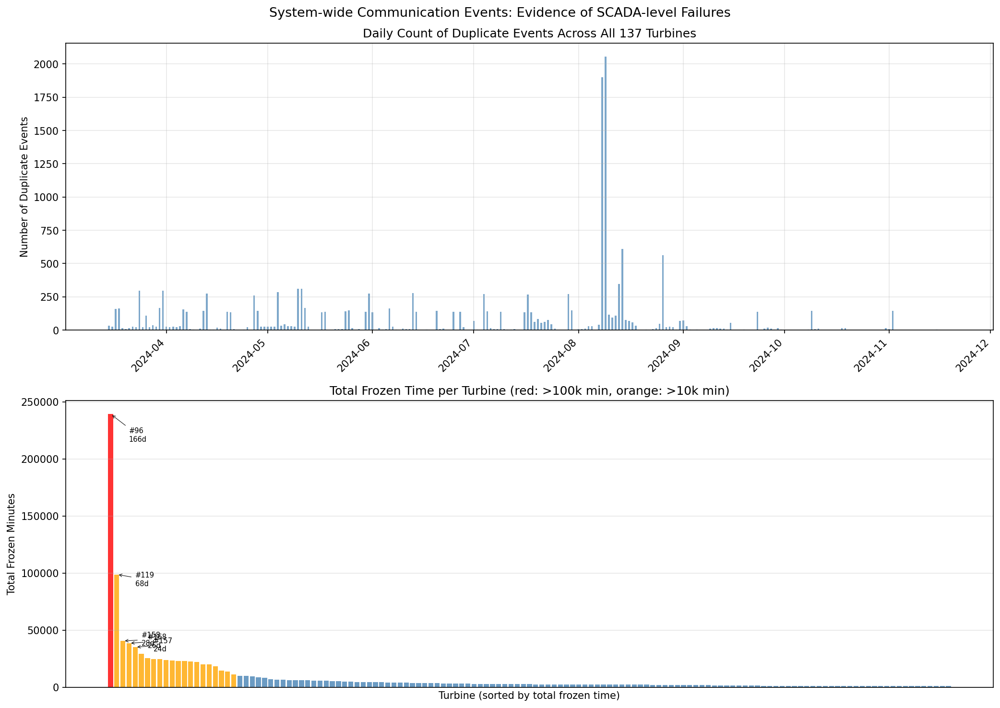
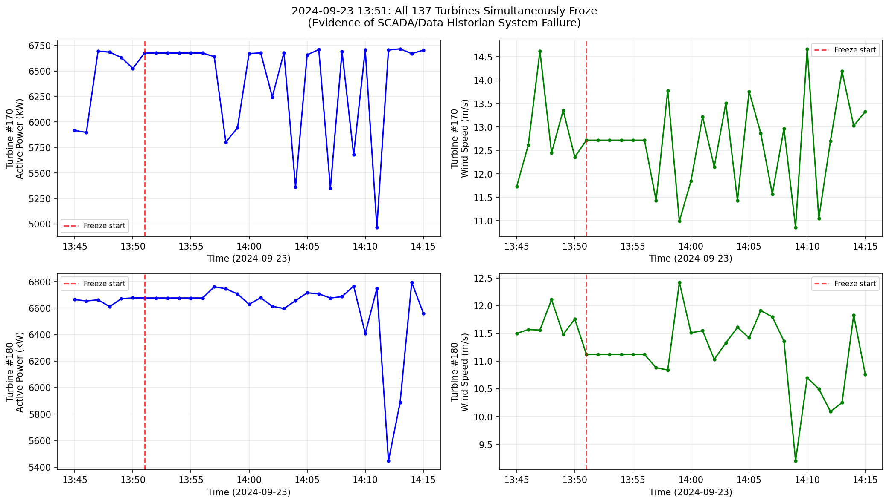

# 风机重复数据原因分析报告

## 一、基本情况概述

**分析数据范围：** 2024年3月15日 — 2024年11月20日，共137台风机（编号63–199）

**重复值检测结果：** 共检测到 **15,920** 个连续重复数据段，总计冻结时长约 **790.4 台·天**（即所有风机重复时长之和）

**个案时序数据：** 重点分析80、135、158、170、180号风机的1分钟粒度数据

---

## 二、核心结论

> **风机数据连续重复的根本原因是 SCADA/数据历史库系统的数据采集链路中断，而非风机本身故障。**

具体体现为两大类：
1. **定时轮询中断**：每天约 05:00、17:00 前后，几乎全场（130+ 台）风机同步出现 5–10 分钟冻结，这是 SCADA 系统定时任务（数据上送/网络切换/轮询周期边界）导致的周期性采集暂停。
2. **通信链路故障**：当 SCADA 与风机（或风机与数据历史库）之间的通信链路发生故障时，历史库持续写入最后一次采集到的值，形成长时间重复段。

---

## 三、证据分析

### 3.1 关键证据：全场同时冻结

这是最有力的证据。分析结果显示：

| 时间点 | 同时冻结台数 | 中位数持续时长 |
|--------|------------|--------------|
| 2024-09-23 13:51 | **137台（全部）** | 6分钟 |
| 2024-11-02 10:38 | **137台（全部）** | 22分钟 |
| 2024-05-11 04:59 | 136台 | 10分钟 |
| 2024-08-08—09（多次） | 130–136台 | 5分钟 |

**137台不同厂家、不同型号的风机在同一时刻同时出现数据冻结，这不可能是各台风机通信同时中断的偶然巧合，只能是 SCADA 上层系统（数据采集服务或数据历史库）出现了整体性故障。**

以 2024-09-23 13:51 为例（图5），170号和180号风机的功率、风速在 13:51 分后的每一分钟完全一致，直到约 13:56 才恢复正常变化，且两台风机的冻结值各不相同（因为它们记录的是各自上一时刻的真实值）。

### 3.2 定时周期性冻结（05:00 与 17:00 规律）

对所有持续 5–10 分钟的短时重复事件（共 9,735 条）按小时分析：

| 时间段 | 事件数 |
|--------|-------|
| 05:00 前后（04:56–05:10） | **约 3,242 条** |
| 17:00 前后（16:56–17:10） | **约 3,059 条** |
| 其余时段 | 约 3,434 条 |

约 **65%** 的短时重复集中在每天两个固定时段。这高度符合 SCADA 系统"定时数据上送/轮询窗口"的特征——系统在每天 05:00 和 17:00 前后进行批量数据上传或内部任务，期间暂停实时采集，历史库维持上一时刻的值。

以80号风机 2024-03-17 05:00 为例：
- 04:59：有功功率 1,695 kW，风速正常变化
- 05:00–05:09：所有5个字段完全锁定为 `(状态=1, 有功=1729kW, 无功=8kvar, 风速=5.21m/s, 风向=-18.5°)`
- 05:10：功率恢复为 2,154 kW，继续正常波动

**数据在完全相同的值停止10分钟后恢复正常波动，这是典型的"数据采集暂停+最后值保持"行为。**

### 3.3 长时间冻结：持续通信故障

部分风机出现持续数小时乃至数天的冻结，按受影响时长排列前10：

| 风机编号 | 厂家 | 最长冻结段 | 总冻结时长 |
|---------|------|----------|---------|
| \#96 | 明阳 | **165天**（2024/3/15–8/27） | 166.2天 |
| \#119 | 金风 | 22.1天 | 68.6天 |
| \#158 | 明阳 | 18.1天（2024/7/7–7/25） | 28.1天 |
| \#168 | 明阳 | 11.9天 | 26.7天 |
| \#157 | 明阳 | 18.4天（2024/7/7–7/25） | 24.3天 |
| \#161 | 明阳 | 10.7天 | 20.3天 |
| \#71 | 明阳 | 14.8天（2024/11/6–11/20） | 17.7天 |
| \#107 | 明阳 | 14.9天（2024/4/21–5/6） | 17.1天 |
| \#91 | 明阳 | 14.9天（2024/4/21–5/6） | 17.0天 |
| \#85 | 明阳 | 14.9天（2024/4/21–5/6） | 16.7天 |

特别注意：**85、91、97、107号风机均在 2024-04-21 14:56 同时开始冻结，持续约 14.9 天至 2024-05-06**，这4台不同编号的明阳风机同时陷入长时冻结，明确说明是通信链路上游某个节点（如该区域的集中器、交换机或SCADA服务器进程）发生了故障，而非风机自身问题。

### 3.4 冻结期间的数据特征

以80号风机 2024-08-09 14:53 至 08-11 17:56（持续 3,064 分钟，约2.1天）为例（图2）：

- 5个字段在整个冻结期间完全相同：状态码=6, 有功=979kW, 无功=24kvar, 风速=5.9603m/s, 风向=5.1823°
- 统计方差为 **零**（std=1.78×10⁻¹⁵，浮点精度误差）
- 冻结的状态码=6（并网不限电），即冻结时刻风机正在正常并网发电
- 冻结结束后，功率恢复正常波动，说明风机本身始终在运行

**2.1天内风速分毫未变是物理上不可能的，因此这100%是通信链路冻结、SCADA历史库重复写入最后一个值。**

### 3.5 状态码的两种情形

#### 情形A：明阳状态码=1（无通讯）+ 有功功率非零

这是最直接的通信故障信号。例如80号风机大量 10 分钟周期性冻结均表现为：
```
状态码=1（无通讯）, 有功功率=1729kW（非零）, 风速=5.2m/s
```
状态码已切换为"无通讯"，但数据是最后一个已知值的保持。说明风机控制器本身能够感知通信断开，并向 SCADA 上报"无通讯"标志，但 SCADA 仍将最后一次收到的所有测量值重复写入历史库。

#### 情形B：状态码=6（并网不限电）+ 所有数据零（停机状态异常）

以158号风机 2024-07-07 至 07-25（冻结 26,132 分钟，约 18.1 天）为例：
```
状态码=6（并网不限电）, 有功=0, 无功=0, 风速=0, 风向=0
```
状态显示"并网不限电"，但功率和风速均为零——物理上矛盾（并网发电的风机风速不可能为零）。这说明数据在某个全零状态被冻结，且就连状态码也是冻结值而非实时值，SCADA 连风机状态都无法正确更新。这是比情形A更严重的通信完全中断。

---

## 四、重复类型分类汇总

基于上述分析，将所有 15,920 条重复事件归类如下：

| 类型 | 事件数 | 平均时长 | 最大时长 | 总冻结分钟 | 占比 |
|------|-------|---------|---------|---------|-----|
| 短时周期性采集中断（5–10分钟） | ~9,735 | ~7分钟 | 10分钟 | ~68,145 | **61%** |
| 通信故障（状态=无通讯，有功非零） | 4,044 | 39.2分钟 | 21,351分钟 | 158,418 | **25%** |
| 停机状态正常保持（全零） | 1,735 | 126分钟 | 31,799分钟 | 218,547 | **11%** |
| 长时发电状态冻结（非零功率） | 313 | 310分钟 | 21,469分钟 | 97,106 | **2%** |
| 其他 | 93 | — | — | — | <1% |

> **注：** "停机状态正常保持"指功率、风速均为零且状态码为停机类状态（如明阳状态3=偏航解缆、13=维护等），这类重复在物理上是合理的（风机静止时传感器读数长时不变），但仍被检测为重复值。

---

## 五、各厂家特殊情况说明

### 5.1 状态码表与实测数据的对应关系

通过对比 `风机状态码说明.md` 与实测数据，发现以下情况：

| 文档中的分类 | 文档中的状态码范围 | 实测状态码（实际使用） |
|------------|-----------------|-------------------|
| 明阳（63–109, 153–168） | 0–24 | 0–24 ✅ 一致 |
| 金风（110–152） | 0–6 | **101–113**（实测为东气范围） |
| 东气（169–199） | 101–113 | **0–6**（实测为金风范围） |

建议核实：文档中金风与东气的**状态码表**可能存在互换，即：
- 编号 110–152 的风机实际使用状态码 101–113（东气状态体系）
- 编号 169–199 的风机实际使用状态码 0–6（金风状态体系）

### 5.2 96号风机（明阳）：极端案例

96号风机从数据开始日（2024-03-15 00:00）至 2024-08-27 11:53，长达 **165天** 的数据完全冻结在 `(状态=6, 功率=0, 风速=0, 风向=0)`。这意味着整个分析窗口前165天该风机均无有效数据，属于彻底的通信链路断开或数据接入故障，建议现场核查该风机数据采集设备。

---

## 六、结论与建议

### 结论

1. **主要原因（约60%事件）：SCADA定时任务导致的周期性采集中断**，每天 05:00 和 17:00 前后约 5–10 分钟，全场几乎所有风机同步受影响，是系统设计层面的规律性现象，不代表风机故障。

2. **次要原因（约25%事件）：通信链路中断（明阳状态=1/无通讯）**，持续时间从 10 分钟到数周不等。此类事件中数据是最后一次收到的真实值的保持，不能用于实际功率统计。

3. **严重案例（约2%事件）：长时发电状态冻结**，若分析期间将这些值当作真实数据使用，会导致功率统计严重偏差（如80号风机2024-08-09至08-11期间功率始终显示为979kW）。

4. **物理静止状态（约11%事件）：停机状态下的全零重复**，此类情况在物理上是合理的，可根据分析目的决定是否保留。

### 数据使用建议

| 场景 | 建议 |
|------|------|
| 发电量统计 | 剔除持续时长 > 30 分钟且状态码显示运行中的重复段 |
| 功率曲线分析 | 剔除所有持续时长 > 10 分钟的重复段（包含周期性中断） |
| 通信质量评估 | 统计每台风机年通信中断总时长（见总冻结时长统计） |
| 停机原因分析 | 保留全零重复段，但需排除明阳状态=6的异常全零段 |
| 重点关注 | 96号、119号、158号风机——年度总冻结时间分别为166、68.6、28天，需检查数据链路 |

---

## 七、附图

### 图1：总体分析概览


*左上：重复事件时长分布（对数坐标），绝大多数集中在5–10分钟，少量极端长时事件为离群点*  
*右上：各时长类别事件数统计*  
*左下：全年重复事件的同时发生规律，红点表示同时冻结超过100台的时间节点*  
*右下：各厂家总重复事件数对比（明阳7,113条、金风5,168条、东气3,639条）*

---

### 图2：80号风机长时冻结详情（2024-08-09 至 08-11，约2.1天）


*红色阴影区域为冻结期，5个字段在3,064分钟内完全保持一致，标准差为零（见第三章3.4节）*

---

### 图3：80号风机周期性短时冻结规律（前两周时序）


*可见有功功率每天约在 05:00 和 17:00 出现短暂水平段，为周期性采集中断的典型表现*

---

### 图4：全场重复事件影响统计


*上图：按天统计的全场重复事件总数，数据采集高峰/集中故障日明显可见*  
*下图：各风机全年总冻结时长（降序排列），红色（>10万分钟）为极端案例，96号、119号风机亟需排查*

---

### 图5：2024-09-23 13:51 全场同步冻结微观对比


*170号和180号风机（均为正常发电状态）在同一时刻停止更新，之后每分钟的读数完全一致，约5分钟后恢复正常波动。这是 SCADA 系统级通信故障的直接证明。*
